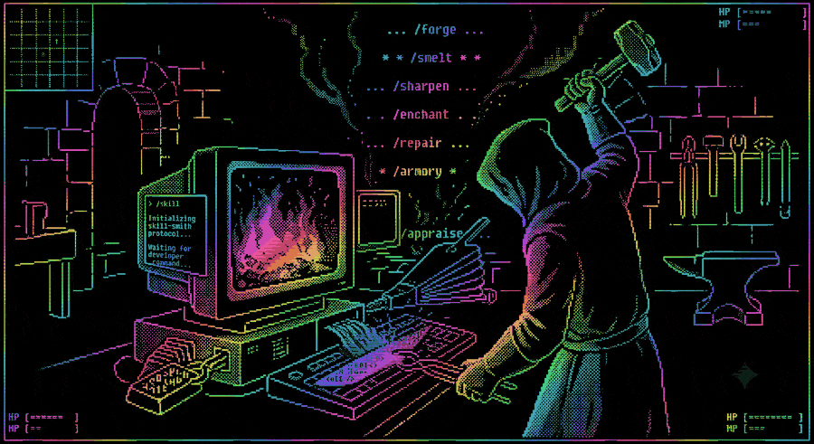

# SKILL-SMITH



```
═══════════════════════════════════════════════════════════
  THE FORGE
═══════════════════════════════════════════════════════════
  A dark room. Coals breathe orange. An anvil, a ledger,
  seven hammers on the wall. The SMITH does not look up.

  "State your business."

  > _
═══════════════════════════════════════════════════════════
```

**Skills** are markdown files that teach your coding agent a behavior or a
procedure — the [Agent Skills](https://agentskills.io) standard, spoken by
Claude Code, Kiro CLI, Codex, and friends. **Skill-Smith is the skill that
makes your other skills good**: it creates them, tests them against a
no-skill baseline, fixes them when they misbehave, and audits the whole
collection. Eight skills, ~340 lines of markdown, zero dependencies.

## WHY (or: most skills you'll find are slop)

The going estimate is that ~80% of skills on the marketplaces are AI slop:
generated in one shot, never tested, restating things the model already
knows, ranked by gameable install counts. A bad skill isn't neutral — it
burns context on every session and teaches your agent wrong things
confidently.

The SMITH's whole design is refusing to produce that:

```
  ✦ baseline first — before forging, watch the agent attempt the
    task with NO skill. If it already succeeds, the SMITH refuses
    the job. A skill the model doesn't need is dead weight at birth.
  ✦ nothing ships untested — every skill must load, activate on the
    right prompts (and stay quiet on near-misses), and beat the
    no-skill baseline. With quoted evidence, not vibes.
  ✦ no anchor, no rule — a claim cites a file, a quote, or the real
    failure it came from. No citation → it becomes a question, never
    written text. The SMITH does not confabulate your codebase.
  ✦ the ledger remembers — every forge, repair, and failed test is
    recorded. Your skill collection has an audit trail.
```

## ALL LOCAL, ALL READABLE

- Plain markdown. No server, no account, no telemetry, no build step,
  no runtime dependencies. `cp -R` is the entire install.
- Small enough to actually review: the whole pack is ~340 lines.
  Read every line before you trust it — that's the point.
- Portable by standard: works in any harness that speaks
  [agentskills.io](https://agentskills.io). Your forged skills are
  self-contained folders — share them without shipping the SMITH along.

## COMMANDS

```
  ⚒️  /forge      create a new skill (baseline-first, approval-gated)
  🔥  /smelt      extract skills from raw docs / transcripts
  ⚡  /sharpen    fix activation, cut bloat
  🔧  /repair     fix wrong behavior, dead references
  🗡️  /temper     test it: loads, activates, behaves, beats baseline
  ⚖️  /appraise   audit all skills: duplicates, stale, dead weight
  🛡️  /armory     character sheet: what's equipped, what it weighs

  🧙  /skill-smith   talk to the SMITH — it picks the
                     commands and the order for you
```

## SAMPLE PLAY

```
  > /skill-smith my pr-review skill backfired

  🔧 /repair · trace the fault
  "The blade bit its wielder — a skill did the wrong
   thing, and we find the exact line that told it to."
  ▬▬▬▬▬▬▬▬▬▬▬▬▬▬
  Plan: /repair → /temper. Paste the prompt that
  triggered it and what the agent did.
```

Every reply, same shape: glyph, one line of forge-talk + plain truth,
a bar, then the actual work in plain engineering.

## WHAT THE SMITH WILL NOT DO

```
  ✗ forge a skill for a task your model already handles
  ✗ write a fact it cannot cite
  ✗ touch disk before you approve the draft
  ✗ report results of tests it did not run
  ✗ put a workflow summary in a description (agents follow the
    shortcut and skip the body — observed, not theoretical)
```

## HOUSE RULES

```
  ✦ no duplicate skills — the one you own gets sharpened
  ✦ nothing ships untested — /forge and /repair end in /temper
  ✦ no anchor, no rule — every claim cites a file, a quote,
    or the failure it came from. no citation → it's a question
  ✦ drafts before disk — the SMITH shows the blade before
    it is forged. nothing is written until you approve
  ✦ the ledger records every change — the forge remembers
  ✦ harness config (steering, CLAUDE.md, hooks) → the SMITH
    fetches the provider's docs and cites them. never guesses.
```

## ENTER THE FORGE

```
  $ git clone https://github.com/fbadanouy/skill-smith
  $ cd skill-smith
  $ ./install.sh          # picks your harness, copies skills/

  or by hand:
  $ cp -R skills/* .kiro/skills/       # Kiro CLI
  $ cp -R skills/* .claude/skills/     # Claude Code

  then summon:
  > /skill-smith
```

## PROVENANCE

The SMITH's rules aren't invented — they're distilled from what actually
holds up: Anthropic's skill-creator eval loop (blind A/B, evidence-quoted
grading), obra/superpowers' TDD-for-skills discipline (no skill without a
failing baseline first), and our own eval runs against a no-skill control.
`PLAN.md` traces every rule to its source.

```
═══════════════════════════════════════════════════════════
  The SMITH nods once. The coals flare.

  EXITS: [skills/]  [install.sh]  [ledger]  [PLAN.md]
═══════════════════════════════════════════════════════════
```
